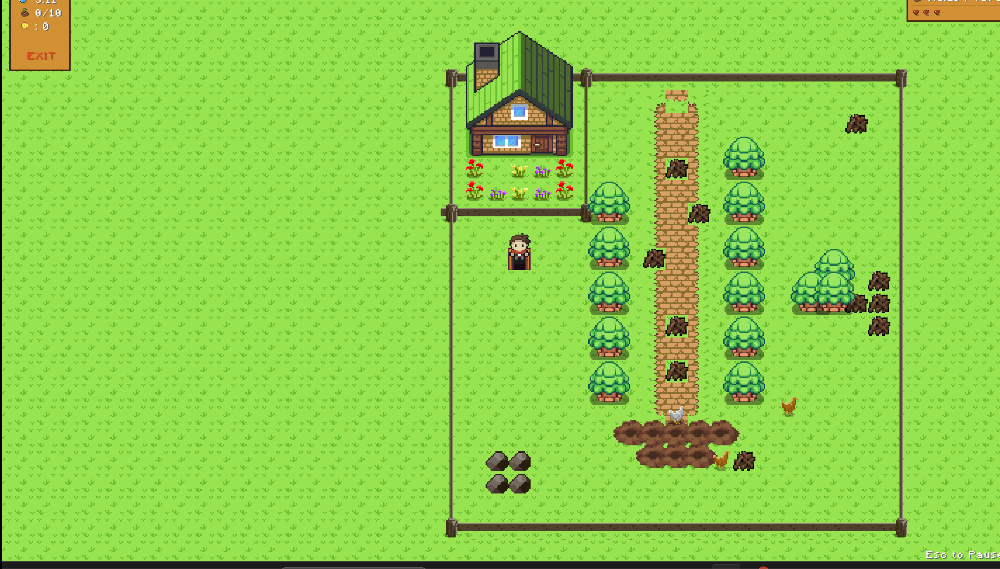
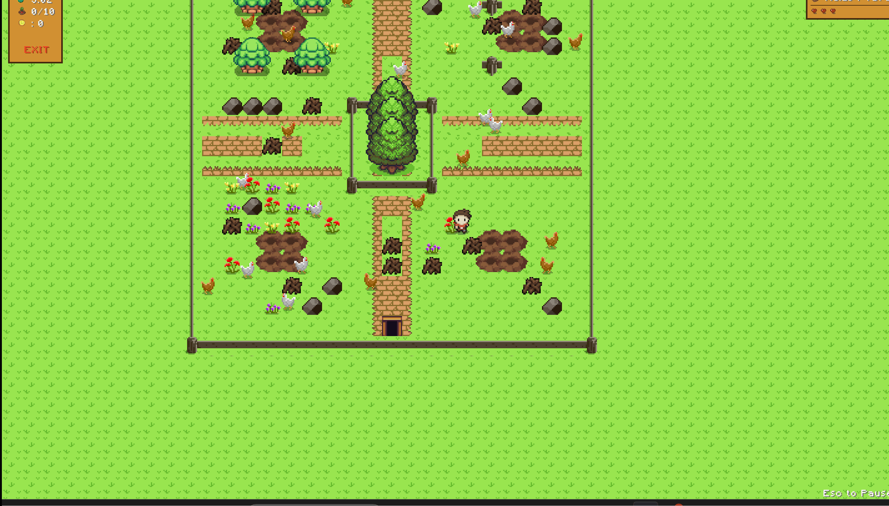

# Valley Day

> A top-down farming adventure built with [LibGDX](https://libgdx.com/) — developed as a project in the TUM Informatics practical course ITP (WS 24/25).

Valley Day puts you on a timer: clear debris, plant and harvest crops, manage stamina, and fend off wildlife before the clock hits zero. Complete the harvest quota to open the exit and move to the next map.

---

## Features

- **Campaign mode** — five-map story sequence with intro cutscenes and a final win cutscene
- **Free play mode** — load any `.properties` map or generate a random one on the fly
- **Four crop types** — Corn, Maize, Lemon, and Celery, each with different growth times and scores; crops can rot and be revived
- **Six collectible items** — Shovel, Fertilizer, Watering Can, Dynamite, Elixir, Clock
- **A\* pathfinding AI** — brown chickens seek out your crops; spiders hunt the player
- **Difficulty settings** — adjustable harvest quota, timer, and player health
- **Full HUD** — health bar, stamina bar, timer, inventory display, and harvest progress
- **Procedural map generation** — debris and soil placed randomly when no layout is specified

---

## Gameplay Preview

A short visual overview of the main gameplay mechanics, user interface, and interactive game flow.

<table>
  <tr>
    <td align="center">
      
      <br/>
      <sub>World exploration</sub>
    </td>
    <td align="center">
      
      <br/>
      <sub>Farming &amp; harvesting</sub>
    </td>
    <td align="center">
      
      <br/>
      <sub>HUD &amp; progression</sub>
    </td>
  </tr>
</table>

---

## How to run

**Requirements:** Java 17+

```bash
# Windows
.\gradlew.bat desktop:run

# macOS / Linux
./gradlew desktop:run
```

---

## Controls

| Key | Action |
|-----|--------|
| Arrow keys | Move (up / down / left / right) |
| Shift | Sprint (stamina-based) |
| A | Plant or harvest on soil tiles |
| D | Chop / destroy obstacles |
| R | Cycle crop type |
| S | Shoo or attack nearby chickens and wildlife |
| Esc | Pause / resume |

---

## Game mechanics

### Core loop
Each level requires harvesting a set number of crops before the exit unlocks. Health reaches zero or the timer expires and it's game over.

### Crop system
Crops progress through growth stages and can rot after the final stage (~60 s). A watering can revives rotting crops. Fertilizer instantly advances one stage.

### Items
| Item | Effect | Location |
|------|--------|----------|
| Shovel | Increases debris damage | Hidden under debris |
| Dynamite | Destroys stone debris | Hidden under debris |
| Fertilizer | Advances crop growth by one stage | Hidden under debris |
| Watering Can | Revives rotting crops | Hidden under debris |
| Elixir | Restores health | Hidden under stone debris |
| Clock | Adds time | Hidden under stone debris |

### AI
- **Brown chickens** — use A\* pathfinding to seek the nearest crop
- **Spiders** — track the player using A\* and attack on contact
- Chickens can be scared off; spiders must be defeated

### Difficulty
Three difficulty presets adjust harvest quota, starting time, and player health. A *Compliance* mode sets values to the exact course specification.

---

## Project layout

```
ValleyDay/
├── core/src/de/tum/cit/aet/valleyday/
│   ├── ValleyDayGame.java          # Main game class (extends LibGDX Game)
│   ├── screen/                     # MenuScreen, GameScreen, HUD, cutscenes
│   ├── map/                        # Map loading, entities, items, crops
│   ├── pathfinding/                # A* search (Gps, GridNode)
│   ├── audio/                      # Music and sound effect enums
│   └── texture/                    # Texture loading, sprite sheets, animations
├── desktop/                        # Desktop launcher
├── assets/                         # Textures, audio, UI skin, cutscenes
└── maps/                           # Campaign and custom .properties map files
```

---

## Architecture

Inheritance (`extends`) and composition (`creates` / `has`):

```
ValleyDayGame (extends Game)
  -> Screen
     -> MenuScreen
     -> GameScreen (creates Hud)
     -> LevelIntroScreen
     -> WinningCutsceneScreen
  -> GameMap (tile layers + entities + items)
     -> Entity
        -> Player
        -> Chicken -> BrownChicken / WhiteChicken
        -> Wildlife -> Spider
     -> hiddenObject
        -> Exit
        -> Item -> Shovel / Fertilizer / WateringCan / Dynamite / Elixir / Clock
     -> Obstacle
        -> Fence
        -> Debris (Destructible)
        -> StoneDebris (Destructible)
        -> Trees / House / BigTree
     -> Crop + CropType
     -> Tiles + TileType
```

Textures, tile definitions, animations, and audio are centralized in `texture/` and `audio/` — gameplay classes reference only enums/constants.

**Design patterns used:**
- *State pattern* — LibGDX `Screen` implementations model game states (menu, gameplay, cutscenes)
- *Data-driven design* — `.properties` map files drive tile and entity placement without code changes

---

## Custom map format

Maps are `.properties` files with lines in the format `x,y=value`.

| Value | Tile / object |
|-------|---------------|
| 0 | Fence (indestructible) |
| 1 | Debris (destructible) |
| 2 | Player spawn |
| 3 | Chicken spawn |
| 4 | Exit (hidden under debris) |
| 5 | Fertilizer (hidden) |
| 6 | Watering can (hidden) |
| 7 | Shovel (hidden) |
| 8 | Soil (plantable) |
| 9 | Lava |
| 10 | Dynamite (hidden) |
| 12 | Spider spawn |
| 13 | Tree (blocking) |
| 21 | Path (walkable) |
| 23 | Elixir (hidden under stone) |
| 25 | Clock (hidden under stone) |
| 26 | Big tree (blocking) |
| 27 | House (blocking) |
| 28–29 | Flowers |
| 30–38 | Path shapes (corners / edges) |
| 40 | Flower (variant 3) |

Campaign maps (`map1.properties` – `mapEG.properties`) live in `maps/`. Cutscene assets are in `assets/cutscenes/`.

---

## Built with

- [LibGDX](https://libgdx.com/) — cross-platform Java game framework
- Java 17
- Gradle

---

## Credits

Music, textures, and sprites used in this project are free / open-licence assets. Full attribution is listed in the asset source files.

Developed by Team *TryCatchReturn35* for the TUM ITP practical course (WS 2024/25).
